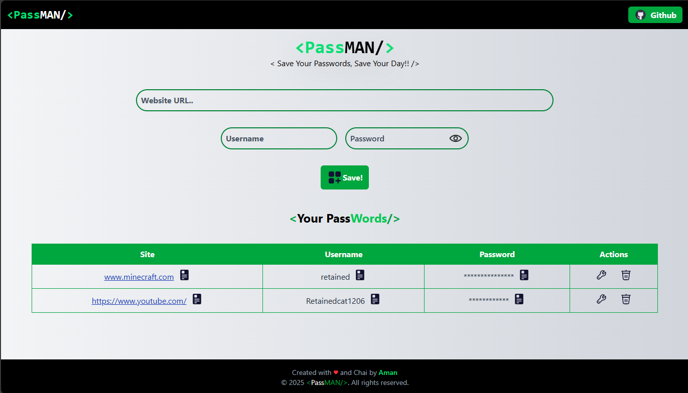
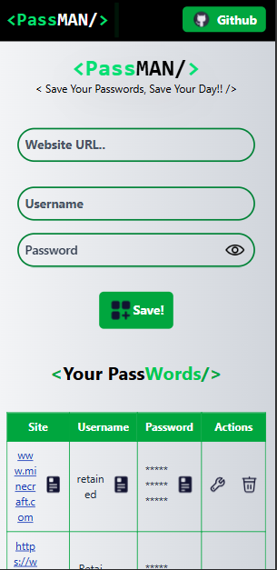

# 🔐 PassMan – Your Own Password Manager

## PassMan is a simple and secure password manager built using React.js.
#### It helps you store and manage your website credentials — site URL, username, and password — locally in your browser using Local Storage, ensuring privacy and full client-side control.

```🚀 Features

✅ Save, view, edit, and delete your passwords
✅ Copy site, username, or password with a single click
✅ Toggle password visibility
✅ Data is stored only in Local Storage (no external database)
✅ Interactive toast notifications for every action
✅ Clean, minimal, and responsive UI built with Tailwind CSS
✅ Icons and animations powered by Lordicon
```
### 🛠️ Tech Stack
```
React.js – Frontend Framework

Tailwind CSS – Styling

React Toastify – Notifications

UUID – Unique ID generation

Local Storage – Client-side data persistence
```
### 📂 Project Setup

To run the project locally:

- Clone the repository
``` 
git clone https://github.com/<your-username>/passman.git 
```
- Navigate to project folder
```
cd passman
```
- Install dependencies
```
npm install
```
- Run the development server
```
npm run dev
```


- Now open your browser and go to http://localhost:5173/
 🚀

### 🧠 How It Works

- Enter the website URL, username, and password.

- Click the Save! button — your credentials are stored in local storage.

- View all saved credentials in a neat, responsive table.

- Easily copy, edit, or delete any saved password.

### 📸 Screenshot




# 📜 License

This project is open-source and available under the MIT License.

💡 Author

-Aman
## 📫 Connect with Me

[](https://github.com/Aman-1206)
[](https://linkedin.com/in/aman-kumar-a2ba54361)
[](mailto:yourname@example.com)


Created with ❤️ and Chai.